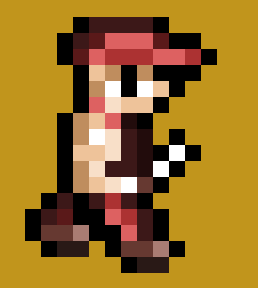
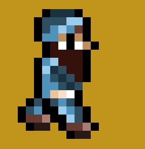
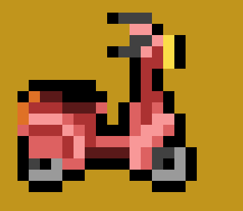
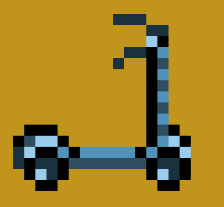
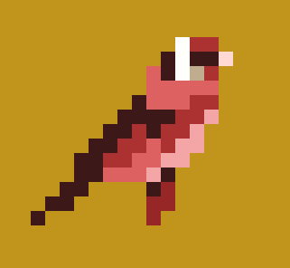
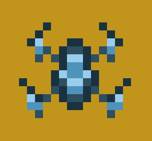
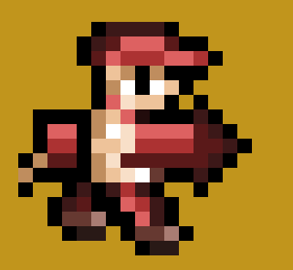
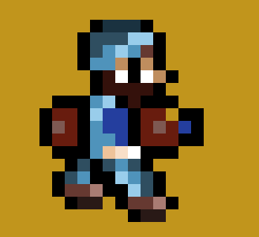
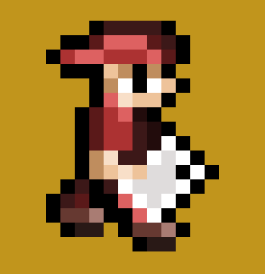
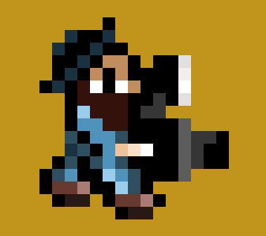

# Warpolis Alpha

# Català

Warpolis és un prototip de videojoc d’estratègia per torns inspirat per la franquícia ”Advance
Wars”, de Nintendo, desenvolupada per Intelligent Systems i abandonada
des de l’any 2008.
En aquest prototip de videojoc s’hi enfronten dos exèrcits, els canis i els hipsters
i lluiten pel control de la ciutat. L’objectiu del jugador és administrar els
seus recursos i seguir una estratègia per tal de complir la condició de victòria, que
és o bé destruir per complet l’exèrcit enemic, conquerir-ne la base central o bé
tenir més control que l’enemic sobre el mapa en haver esgotat el nombre de torns
màxim de la partida.
Warpolis ha estat desenvolupat amb Unity, és d’estètica pixel art i tot el què
conté és feina original meva, excepte la banda sonora que a dia d'avui 20/04/2020 és un "placeholder".

- Repository del projecte (https://github.com/albertllopart/Warpolis-TFG-Unity)
- Github del creador, Albert Llopart Navarra (https://github.com/albertllopart)

L'scripting del projecte està fet íntegrament amb C#.

## Informació Important

- Actualment el menú principal del joc és una imatge estàtica sense funcionalitat. Prement el botó 'O' del teclat o 'X' del comandament iniciarà una nova partida.

- L'únic mode de joc que hi ha disponible a dia d'avui 20/04/2020 és multijugador local u contra u.

- Qualsevol dubte sentiu-vos lliures de contactar amb mi per twitter @pocafeiner, o per qualsevol altre mitjà que estigui al vostre abast en cas de relació més propera.

## Controls

### Teclat

- WASD: moure el cursor pel mapa
- O: confirmar acció / interactuar amb la casella actual
- K: cancel·lar acció / comprovar rang d'atac de la unitat

### Comandament

- Pad direccional: moure el cursor pel mapa
- Botó Sud (X): confirmar acció / interactuar amb la casella actual
- Botó Oest ([]): cancel·lar acció / comprovar rang d'atac de la unitat

## Gameplay

### Flux de la partida

- A l'inici de cada torn l'exèrcit rebrà 1.000 (mil) unitats monetàries per cada edifici que estigui sota el seu control.

- Seguidament totes aquelles unitats que hagin rebut mal i estiguin ubicades damunt d'un edifici aliat recuperaran un 20% de la salut màxima a canvi d'un 20% del seu valor d'unitat en unitats monetàries.

- Després d'això el jugador és lliure de realitzar totes les accions que cregui convenients.

### Accions

- Interactuar amb una casella: Interactuar amb una casella buida d'elements interactuables obrirà el menú d'opcions, que de moment conté la opció de passar torn o sortir del joc. Alerta, però, ja que encara no es pot guardar ni carregar partida, així que un cop surtis del programa no hi ha cap manera de recuperar la partida anterior.

- Si la casella conté una botiga aliada s'obrirà el menú de botiga per comprar unitats pel seu cost en unitats monetàries.

- Si la casella conté una unitat aliada se seleccionarà aquella unitat i mostrarà el seu rang de moviment. Si es torna a interactuar amb una casella que es troba disponible dins del rang de moviment la unitat es mourà fins la mateixa i obrirà el menú d'unitat, on el jugador haurà de decidir entre les diferents opcions (veure més endavant).

- Si la casella conté una unitat enemiga el jugdor podrà veure'n el rang de moviment. També hi ha la opció d'apretar el botó de 'Cancel·lar acció' per veure el rang d'atac de la unitat, especialment útil per controlar les caselles que es troben amenaçades per l'enemic.

### Mecànica de captura

- Per iniciar la captura d'un edifici cal ubicar una unitat d'infanteria damunt del mateix i prémer el botó 'Capture'. 
- Cada edifici té 10 punts de captura i per a capturar-lo el jugador ha d'aconseguir baixar aquests punts a 0. 
- Quan una unitat d'infanteria realitza l'acció de capturar baixa tants punts de captura a l'edifici com salut té la unitat, essent 5 la salut màxima de totes les unitats. D'això s'infereix que, com a mínim es triga dos torns a capturar un edifici.
- Si la infanteria que està capturant l'edifici realitza qualsevol altra acció abans d'haver acabat la captura del mateix aquest recuperarà els 10 punts de captura inicials.
- Si la infanteria que està capturant l'edifici és eliminada en combat l'edifici també recuperarà els 10 punts de captura inicials.

### Menú d'unitat

- Wait: Aquest botó confirma l'acció de moure sense més.

- Attack: Aquest botó inicia la funcionalitat per atacar unitats enemigues.

- Capture: Aquest botó inicia o continua la captura de l'edifici subjacent. Només les unitats d'infanteria ho poden fer.

- Load: Aquest botó carrega una unitat d'infanteria damunt d'una unitat de transport. La unitat d'infanteria previament ha d'haver mogut a la mateixa casella que la unitat de transport aliada.

- Drop: Aquest botó inicia la funcionalitat de descarregar una unitat d'infanteria carregada a una unitat de transport.

## Tipus d'unitat

*Les unitats llistades a continuació estan ordenades igual que a la botiga. Sóc molt conscient que, ara mateix, hi falta molta informació, així que ho explicaré tot amb detall aquí.

### Infanteria

- Cost: 1000

És la unitat més dèbil i lenta i s'encarrega de capturar edificis.

 

### Transport

- Cost 5000

En el cas dels Canis és una moto, i en el cas dels Hipsters, un patinet. Aquesta unitat no pot atacar però serveix per transportar infanteries de forma més ràpida pel mapa. També són útils per bloquejar camins o parar ofensives fent de barrera a altres unitats més dèbils però amb poder ofensiu.

 

### Tanc

- Cost 7000

És la unitat terrestre més robusta i útil contra tota la resta d'unitats terrestres. En el cas dels Canis és un cotxe i en el dels Hipsters, una Furgoneta.

 

### Aeria

- Cost 9000

En el cas dels Canis és una cadernera i en els dels Hipsters, un dron. És una unitat molt ràpida ja que no té impediments de moviment per tipus de terreny. Útil contra totes les unitats terrestres excepte contra l'artiller, que la destrueix amb facilitat.

 

### Artiller

- Cost 8.000

És una unitat molt útil contra infanteria i contra aeria. En el cas dels Canis és un cani amb un foc artificial i en el cas dels Hipsters, un hipster amb una ampolla de refresc gasós.

 

### A distància

- Cost 6.000

En el cas dels canis és un Cani amb un smartphone i en el cas dels Hipsters, un fotògraf. És una unitat que només pot atacar a distància a un rang d'entre 2 i 4 caselles. Només pot atacar si ho fa des de la mateixa casella on ha començat el torn. No pot moure i atacar al mateix torn.

 

## Tipus de casella

Cada tipus de casella atorga punts de defensa a la unitat que conté. Cada punt de defensa redueix un 10% del mal rebut per la unitat. Les unitats aeries no es beneficien de la defensa de les caselles, a l'anar pel cel.

- Carretera: Defensa 0
- Mar: Defensa 0
- Obres: Defensa 0
- Vorera: Defensa 1
- Jardinera: Defensa 2
- Edifici: Defensa 3
- Fanal: Defensa 4

Algunes caselles entorpeixen el moviment d'algunes unitats. L'exemple més clar és el fanal, que només pot ser atravessat o trepitjat per infanteria o unitats aeries.

# Castellano

Esta traducción ha sido realizada mediante un traductor automático. Pido disculpas por cualquier error que haya podido escapar a mi revisión rápida.

Warpolis es un prototipo de videojuego de estrategia por turnos inspirado por la franquicia ”Advance
Wars”, de Nintendo, desarrollada por Intelligent Systems y abandonada
desde el año 2008.
En este prototipo de videojuego se enfrentan dos ejércitos, los canis y los hipsters
y luchan por el control de la ciudad. El objetivo del jugador es administrar sus
recursos y seguir una estrategia para cumplir la condición de victoria, que
es o bien destruir por completo el ejército enemigo, conquistar la base central o bien
tener más control que el enemigo sobre el mapa al haber agotado el número de turnos
máximo de la partida.
Warpolis ha sido desarrollado con Unity, es de estética píxel arte y todo lo qué
contiene es trabajo original mío, excepto la banda sonora que a día de hoy 20/04/2020 es un "placeholder".

- Repository del proyecto (https://github.com/albertllopart/warpolis-tfg-unity)
- Github del creador, Albert Llopart Navarra (https://github.com/albertllopart)

El scripting del proyecto está hecho íntegramente con C#.

## Información Importante

- Actualmente el menú principal del juego es una imagen estática sin funcionalidad. Pulsando el botón 'O' del teclado o 'X' del mando iniciará una nueva partida.

- El único modo de juego que hay disponible a día de hoy 20/04/2020 es multijugador local uno contra uno.

- Cualquier duda sentíos libras de contactar conmigo por twitter @pocafeiner, o por cualquier otro medio que esté a vuestro alcance en caso de relación más próxima.

## Controles

### Teclado

- WASD: mover el cursor por el mapa
- O: confirmar acción / interactuar con la casilla actual
- K: cancelar acción / comprobar rango de ataque de la unidad

### Mando

- Pad direccional: mover el cursor por el mapa
- Botón Sur (X): confirmar acción / interactuar con la casilla actual
- Botón Oeste ([]): cancelar acción / comprobar rango de ataque de la unidad

## Gameplay

### Flujo de la partida

- Al inicio de cada turno el ejército recibirá 1.000 (mil) unidades monetarias por cada edificio que esté bajo su control.

- Seguidamente todas aquellas unidades que hayan recibido daño y estén ubicadas encima de un edificio aliado recuperarán un 20% de la salud máxima a cambio de un 20% de su valor de unidad en unidades monetarias.

- Después de esto el jugador es libre de realizar todas las acciones que crea convenientes.

### Acciones

- Interactuar con una casilla: Interactuar con una casilla vacía de elementos interactuables abrirá el menú de opciones, que de momento contiene la opción de pasar turno o salir del juego. Alerta, pero, puesto que todavía no se puede guardar ni cargar partida, así que una vez salgas del programa no hay ninguna manera de recuperar la partida anterior.

- Si la casilla contiene una tienda aliada se abrirá el menú de tienda para comprar unidades por su coste en unidades monetarias.

- Si la casilla contiene una unidad aliada se seleccionará aquella unidad y mostrará su rango de movimiento. Si se vuelve a interactuar con una casilla que se encuentra disponible dentro del rango de movimiento la unidad se moverá hasta la misma y abrirá el menú de unidad, donde el jugador tendrá que decidir entre las diferentes opciones (ver más adelante).

- Si la casilla contiene una unidad enemiga lo jugdor podrá ver el rango de movimiento. También hay la opción de apretar el botón de 'Cancelar acción' para ver el rango de ataque de la unidad, especialmente útil para controlar las casillas que se encuentran amenazadas por el enemigo.

### Mecánica de captura

- Para iniciar la captura de un edificio hay que ubicar una unidad de infantería encima del mismo y pulsar el botón 'Capture'.
- Cada edificio tiene 10 puntos de captura y para capturarlo el jugador tiene que conseguir bajar estos puntos a 0.
- Cuando una unidad de infantería realiza la acción de capturar baja tantos puntos de captura en el edificio como salud tiene la unidad, siendo 5 la salud máxima de todas las unidades. De esto se infiere que, como mínimo se tarda dos turnos en capturar un edificio.
- Si la infantería que está capturando el edificio realiza cualquier otra acción antes de haber acabado la captura del mismo este recuperará los 10 puntos de captura iniciales.
- Si la infantería que está capturando el edificio es eliminada en combate el edificio también recuperará los 10 puntos de captura iniciales.

### Menú de unidad

- Wait: Este botón confirma la acción de mover sin más.

- Attack: Este botón inicia la funcionalidad para atacar unidades enemigas.

- Capture: Este botón inicia o continúa la captura del edificio subyacente. Solo las unidades de infantería lo pueden hacer.

- Load: Este botón carga una unidad de infantería encima de una unidad de transporte. La unidad de infantería previament tiene que haber movido a la misma casilla que la unidad de transporte aliada.

- Drop: Este botón inicia la funcionalidad de descargar una unidad de infantería cargada a una unidad de transporte.

## Tipo de unidad

Las unidades listadas a continuación están ordenadas igual que en la tienda. Soy muy consciente que, ahora mismo, falta mucha información, así que lo explicaré todo con detalle aquí.

### Infantería

- Coste: 1000

Es la unidad más débil y lenta y se encarga de capturar edificios.

 

### Transporte

- Coste 5000

En el caso de los Canis es una moto, y en el caso de los Hipsters, un patinete. Esta unidad no puede atacar pero sirve para transportar infanterías de forma más rápida por el mapa. También son útiles para bloquear caminos o parar ofensivas haciendo de barrera a otras unidades más débiles pero con poder ofensivo.

 

### Tanque

- Coste 7000

Es la unidad terrestre más robusta y útil contra todo el resto de unidades terrestres. En el caso de los Canis es un coche y en el de los Hipsters, una Furgoneta.

 

### Aeria

- Coste 9000

En el caso de los Canis es un jilguero y en los de los Hipsters, un dron. Es una unidad muy rápida puesto que no tiene impedimentos de movimiento por tipo de terreno. Útil contra todas las unidades terrestres excepto contra el artillero, que la destruye con facilidad.

 

### Artillero

- Coste 8.000

Es una unidad muy útil contra infantería y contra aeria. En el caso de los Canis es un cani con un fuego artificial y en el caso de los Hipsters, un hipster con una botella de refresco gaseoso.

 

### A distancia

- Coste 6.000

En el caso de los canis es un Cani con un smartphone y en el caso de los Hipsters, un fotógrafo. Es una unidad que solo puede atacar a distancia a un rango de entre 2 y 4 casillas. Solo puede atacar si lo hace desde la misma casilla donde ha empezado el turno. No puede mover y atacar al mismo turno.

 

## Tipo de casilla

Cada tipo de casilla otorga puntos de defensa a la unidad que contiene. Cada punto de defensa reduce un 10% del mal recibido por la unidad. Las unidades aeries no se benefician de la defensa de las casillas, a la ir por el cielo.

- Carretera: Defiende 0
- Mar: Defiende 0
- Obras: Defiende 0
- Acera: Defiende 1
- Jardinera: Defiende 2
- Edificio: Defiende 3
- Farola: Defiende 4

Algunas casillas entorpecen el movimiento de algunas unidades. El ejemplo más claro es la farola, que solo puede ser atravessada o pisada por infantería o unidades aeries.

# English

This translation has been performed by an automàtic translator. I apologize for any errors that may have escaped my quick revision.

Warpolis is a prototype of video game of strategy in turns inspired by the franchise ”Advance
Wars”, of Nintendo, developed by Intelligent Systems and abandoned
since the year 2008.
In this prototype of video game two armies, the canis and the hipsters, that
battle for the control of the city. The aim of the player is to administer his
resources and track a strategy for such to conform the condition of victory, that
is either destroy all enemies, conquer their base or
have more control that the enemy over the map when having exhausted the number of maximum
turns of the game.
Warpolis has been developed with Unity, is made of pixel art and all of what
contains is my original work, except for the soundtrack that as of today 20/04/2020 is a "placeholder".

- Repository of the project (https://github.com/albertllopart/*Warpolis-*TFG-*Unity)
- Github of the creator, Albert Llopart Navarra (https://github.com/albertllopart)

The scripting of the project is made entirely with C#.

## Important information

- Currently the main menu of the game is a static image without functionality. Pressing the 'O' button on the keyboard or 'X' on the remote will start a new game.

- The only game mode available today 04/20/2020 is local multiplayer one on one.

- Any questions feel free to contact me on twitter @pocafeiner, or by any other means within your reach in case of a closer relationship.

## Controls

### Keyboard

- WASD: move the cursor on the map
- Or: confirm action / interact with current box
- K: cancel action / check unit attack range

### Gamepad

- Directional pad: move the cursor on the map
- South button (X): confirm action / interact with the current box
- West Button ([]): cancel action / check unit attack range

## Gameplay

### Game flow

- At the beginning of each turn the army will receive 1,000 (thousand) monetary units for each building that is under its control.

- Then all those units that have received damage and are located on top of an allied building will recover 20% of the maximum health in exchange for 20% of their unit value in monetary units.

- After this the player is free to carry out all the actions he deems appropriate.

### Actions

- Interact with a space: Interacting with an empty space with interactive elements will open the options menu, which currently contains the option to end turn or exit the game. Beware, since you cannot save or load the game yet, so once you exit the program there is no way to recover the previous game.

- If the box contains an allied store, the store menu will open to buy units for their cost in monetary units.

- If the box contains an allied unit, that unit will be selected and its range of movement will be shown. If you interact with a space that is available within the range of movement, the unit will move to it and open the unit menu, where the player will have to decide between the different options (see below).

- If the space contains an enemy unit, the player will be able to see the range of movement. There is also the option of pressing the 'Cancel Action' button to see the attack range of the unit, especially useful to control the squares that are threatened by the enemy.

### Capture mechanics

- To start capturing a building, place an infantry unit on top of it and press the Capture button.
- Each building has 10 capture points and to capture it the player has to get these points down to 0.
- When an infantry unit performs the action of capturing as many capture points in the building as health has the unit, with 5 being the maximum health of all units. From this it is inferred that it takes at least two shifts to capture a building.
- If the infantry that is capturing the building performs any other action before the capture is completed, it will recover the initial 10 capture points.
- If the infantry that is capturing the building is eliminated in combat the building will also recover the initial 10 capture points.

### Unit menu

- Wait: This button confirms the action of moving without more.

- Attack: This button initiates the functionality to attack enemy units.

- Capture: This button initiates or continues capturing the underlying building. Only infantry units can do this.

- Load: This button loads an infantry unit on top of a transport unit. The infantry unit must have previously moved to the same box as the Allied transport unit.

- Drop: This button starts the functionality of dropping a loaded infantry unit to a transport unit.

## Type of unit

The units listed below are ordered in the same way as in the store. I am very aware that a lot of information is missing right now, so I will explain everything in detail here.

### Infantry

- Cost: 1000

It is the weakest and slowest unit and is responsible for capturing buildings.

 

### Transport

- Costs 5000

In the case of the Canis it is a motorcycle, and in the case of the Hipsters, a skateboard. This unit cannot attack but is used to transport infantry faster on the map. They are also useful for blocking offensives or stopping offensives, making other units weaker but with offensive power.

 

### Tank

- Cost 7000

It is the most robust and useful ground unit against all other ground units. In the case of the Canis it is a car and in the case of the Hipsters, a Van.

 

### Aerial

- It costs 9000

In the case of the Canis he is a gambler and in the Hipsters, a drone. It is a very fast unit since it does not have obstacles of movement by type of terrain. Useful against all land units except against the gunner, who easily destroys it.

 

### Gunner

- It costs 8,000

It is a very useful unit against infantry and against air. In the case of the Canis it is a dog with a firework and in the case of the Hipsters, a hipster with a bottle of soda.

 

### Ranged

- Costs 6,000

In the case of the Cani it is a Canis with a smartphone and in the case of the Hipsters, a photographer. It is a unit that can only attack from a distance between 2 and 4 squares. It can only attack if it does from the same square where the turn has begun. He cannot move and attack at the same turn.

 

## Type of box

Each type of box grants points of defense to the unit that contains. Each point of defense reduces 10% of the damage received by the unit. The aerial units do not benefit from the defense of the squares, when going by the sky.

- Road: Defend 0
- Mar: Defend 0
- Works: Defends 0
- Sidewalk: Defend 1
- Gardener: Defends 2
- Building: Defend 3
- Streetlight: Defends 4

Some boxes obstruct the movement of some units. The clearest example is the street lamp, which can only be crossed or trampled by infantry or aerial units.

## License

MIT License

Copyright (c) 2018 

Permission is hereby granted, free of charge, to any person obtaining a copy
of this software and associated documentation files (the "Software"), to deal
in the Software without restriction, including without limitation the rights
to use, copy, modify, merge, publish, distribute, sublicense, and/or sell
copies of the Software, and to permit persons to whom the Software is
furnished to do so, subject to the following conditions:

The above copyright notice and this permission notice shall be included in all
copies or substantial portions of the Software.

THE SOFTWARE IS PROVIDED "AS IS", WITHOUT WARRANTY OF ANY KIND, EXPRESS OR
IMPLIED, INCLUDING BUT NOT LIMITED TO THE WARRANTIES OF MERCHANTABILITY,
FITNESS FOR A PARTICULAR PURPOSE AND NONINFRINGEMENT. IN NO EVENT SHALL THE
AUTHORS OR COPYRIGHT HOLDERS BE LIABLE FOR ANY CLAIM, DAMAGES OR OTHER
LIABILITY, WHETHER IN AN ACTION OF CONTRACT, TORT OR OTHERWISE, ARISING FROM,
OUT OF OR IN CONNECTION WITH THE SOFTWARE OR THE USE OR OTHER DEALINGS IN THE
SOFTWARE.
